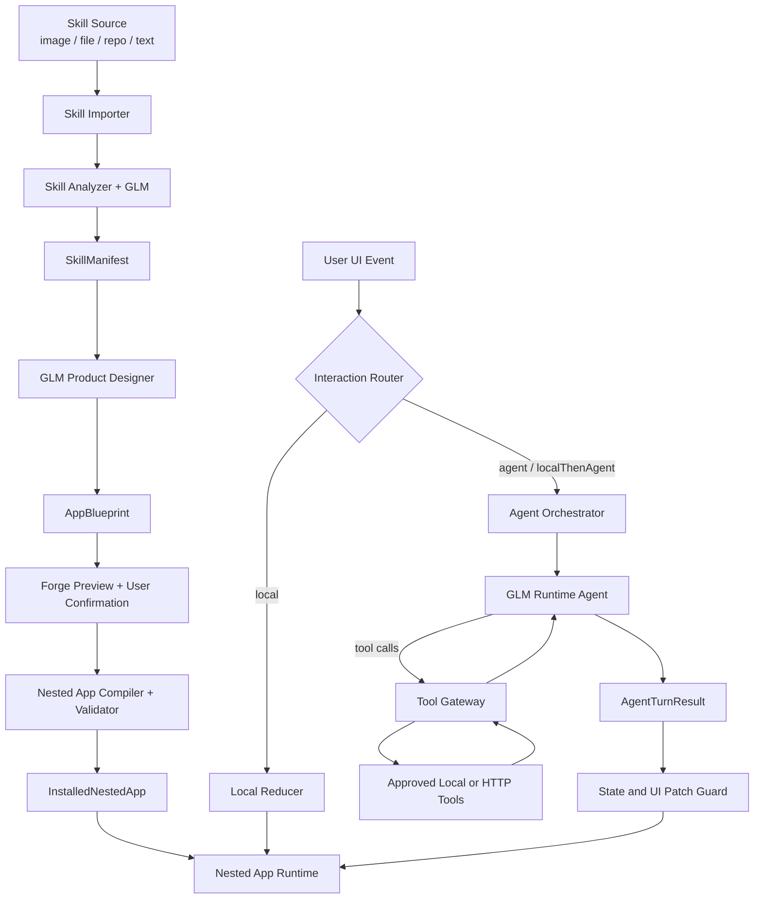
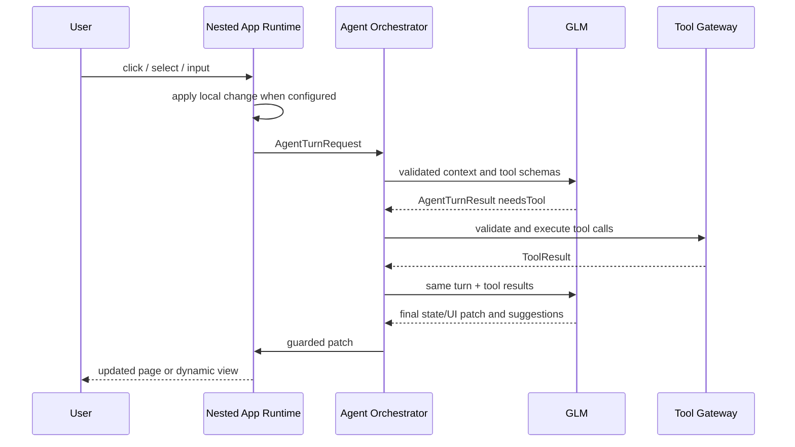

# Skill-to-Nested-App 通用生成与 Agent 运行架构设计

- 日期：2026-07-13
- 状态：已确认，待实现计划
- 适用工程：`glm-a2ui-card`
- 首批验收 Skill：旅行规划图片、[Seniverse Skills](https://github.com/seniverse/skills)

## 1. 背景

现有工程已经具备 HarmonyOS ArkUI 应用、GLM 调用、A2UI/Nested App DSL、App 内渲染、旅行 Demo、图片导入和基础 Agent/tool call 能力。当前实现仍以旅行场景和固定 reducer 为中心，GLM 主要负责首次生成 Spec，运行时交互未形成通用的 Agent 协议。

本设计把产品从“根据 Prompt 生成卡片”提升为“根据任意 Skill 设计并运行一个 Nested App”。天气、旅行等应用不是平台内置业务，而是通用生成流程的验收样例。

平台需要完成两件事：

1. 设计时：读取 Skill，使用 GLM 生成完整、可预览、可校验的应用蓝图。
2. 运行时：让用户通过生成的 UI 使用 Skill，并由 GLM 根据 UI 事件、会话状态和工具结果持续主导语义交互。

## 2. 目标

### 2.1 产品目标

- 用户可以通过图片、文件、公开仓库链接或文字描述提供一个 Skill。
- GLM 自动分析 Skill 的能力、输入、输出、工具、约束和人工决策点。
- GLM 为 Skill 设计一套具有信息层级、视觉风格和完整交互的 Nested App，而不是生成一组相互独立的桌面卡片。
- 用户确认预览后进入一个独立、可持续使用的 Nested App。
- 用户点击、选择或输入可以触发本地交互，也可以触发 GLM 推理、function call、状态更新、导航或受控的临时 UI 生成。
- 主要流程尽量通过自动补全、点选和快捷动作完成，键盘与语音只作为兜底。
- 平台使用高质量 ArkUI 材质和组件渲染 DSL，GLM 负责布局与交互设计。

### 2.2 工程目标

- Skill、应用蓝图、渲染 Spec、会话状态和 Agent Turn 之间有明确边界。
- 简单交互低延迟、无需调用 GLM；语义交互由 GLM 主导。
- tool call、UI patch、网络目标和密钥访问均受白名单约束。
- 非法模型输出、网络失败或工具失败不能导致应用闪退。
- 已生成应用和会话可以持久化并在 App 重启后恢复。

## 3. 非目标

MVP 不包含：

- 执行 GLM 生成的 ArkTS、JavaScript 或其他任意代码。
- 从第三方 Skill 仓库自动安装或执行脚本。
- 任意网络域名或任意 function call。
- 真实交通、酒店、地图、支付、预订或交易操作。
- 复杂 Blueprint 版本迁移和跨设备同步。
- 强制生成桌面 Form 或把 Nested App 限制为桌面卡片。
- 面向生产环境的完整测试矩阵、插件市场或远端多租户后台。

## 4. 已确认的核心决策

### 4.1 两阶段生成与受控演化

采用方案 C：

- Forge 阶段生成大部分页面、布局、状态模型、动作绑定、工具契约和 Runtime System Prompt。
- Runtime 阶段由 GLM 处理语义交互，并在预先声明的动态插槽内生成临时 UI。
- 平台不允许 GLM 在每轮交互中任意重写整个应用。

该方案在泛化能力、稳定性、延迟和可恢复性之间取得平衡。

### 4.2 混合交互编排

每个动作在 Blueprint 中声明处理策略：

- `local`：页面切换、展开、筛选、日期切换等确定性操作。
- `agent`：咨询、解释、比较、规划、总结等语义操作。
- `localThenAgent`：先即时更新 UI，再让 GLM 基于新状态推理。

GLM 主导复杂任务，但普通点击不会产生不必要的网络等待和费用。

### 4.3 App 直接请求外部服务

MVP 由 HarmonyOS App 保存心知天气 API Key，并由 App 内 Tool Gateway 请求心知天气 API。

- 密钥使用 HUKS 支持的加密凭据存储。
- Prompt、Blueprint、NestedAppSpec、Session 和日志中只保存 `credentialRef`，不保存密钥。
- GLM 只能看到工具 Schema 和脱敏后的工具结果。
- 网络目标由安装时确认的工具契约和域名白名单决定，GLM 运行时不能修改 URL。

### 4.4 仪表盘优先、点选优先

天气样例使用情境仪表盘作为首页，但平台不固定该页面结构。GLM 可以为不同 Skill 选择仪表盘、任务入口、表单、时间线、目录或其他信息架构。

所有生成应用遵循以下交互约束：

- 自动使用已授权上下文补全地点、时间、单位和历史偏好。
- 自由输入前先提供结构化选项。
- Agent 每轮返回 2 至 4 个建议动作。
- 缺少信息时一次只询问一个阻塞字段。
- 键盘和语音入口默认收起，不能成为主要流程的唯一入口。

## 5. 总体架构



### 5.1 平台固定能力

- Skill 导入器和内容大小限制。
- A2UI 基础组件、材质、主题 token 和 ArkUI Renderer。
- DSL Schema、编译器、校验器和降级逻辑。
- 路由、状态存储、事件协议和恢复机制。
- Agent Orchestrator、Tool Gateway、权限和密钥存储。
- 工具、网络域名和 UI patch 白名单。
- 日志脱敏、超时、重试和最后可用状态回退。

### 5.2 GLM 为每个 Skill 生成的能力

- 信息架构和页面集合。
- 页面布局、组件组合、视觉 token 建议和媒体查询。
- 初始状态、数据绑定和默认流程。
- 快捷动作、人工确认点和动作处理策略。
- Tool Contract 引用和参数映射。
- Runtime System Prompt 和动态 UI 插槽策略。
- 加载、空状态、错误和结果展示内容。

## 6. Forge User Journey

默认流程只要求用户参与三件事：提供 Skill、完成必要授权、确认预览。

### 6.1 步骤

1. **提供 Skill**
   - 选择图片、文件、公开仓库链接或输入文字描述。
   - App 保存来源引用和本地文件副本，不立即要求用户填写应用结构。
2. **能力分析**
   - 导入器读取可用内容。
   - GLM 生成 `SkillManifest`，识别目标、输入、输出、工具、流程、约束和人工决策点。
3. **必要设置**
   - App 只询问缺失且阻塞运行的 API Key、权限或高风险授权。
   - 可推断项使用默认值，不要求用户重复输入。
4. **设计应用**
   - GLM 根据 Manifest、平台组件目录和设计约束生成 `AppBlueprint`。
   - Compiler 生成可运行的 `NestedAppSpec` 并预先校验。
5. **确认预览**
   - 用户查看实时预览、页面地图、所需权限和工具列表。
   - 主操作为“创建应用”。
   - 调整优先使用“更简洁”“更视觉化”“减少输入”“减少步骤”“重新配色”等快捷项。
   - 自由文本只用于表达结构化选项无法描述的修改。
6. **编译与安装**
   - 校验 Schema、组件、绑定、路由、状态、工具和安全策略。
   - 自动修复失败 Blueprint；成功后保存为 `InstalledNestedApp`。
7. **运行**
   - 打开独立 Nested App。
   - 本地交互即时响应，语义交互进入 Agent Loop。

### 6.2 Forge 界面

MVP 只保留四个 Forge 页面：

- `forge_import`：来源选择和最近草稿。
- `forge_analyze`：分析进度、识别摘要和缺失项。
- `forge_setup`：权限、凭据和风险确认。
- `forge_preview`：实时预览、页面地图、设计调整和创建按钮。

生成完成后在新页面中打开 Nested App，不返回桌面卡片流程。

### 6.3 仓库导入策略

MVP 的公开仓库导入只读取文本资源，不执行代码：

- 支持 GitHub/GitCode 仓库 URL 和直接文件 URL。
- MVP 只允许配置过的 HTTPS 主机；重定向后重新校验主机，避免通过 URL 访问本机或内网资源。
- 优先读取根 README、发现的 `SKILL.md` 及其直接引用的同仓库文本文件。
- 限制文件数量、单文件大小和总字符数。
- 忽略二进制、可执行文件、依赖目录和脚本执行说明。
- 获取失败时保留 URL，并允许用户上传对应文件或粘贴描述继续。

## 7. 核心数据模型

### 7.1 SkillSource

```typescript
interface SkillSource {
  id: string;
  kind: 'image' | 'file' | 'repository' | 'text';
  displayName: string;
  uri?: string;
  localAssetIds: string[];
  textContent?: string;
  importedAt: number;
}
```

### 7.2 SkillManifest

```typescript
interface SkillManifest {
  schemaVersion: string;
  skillId: string;
  skillName: string;
  version: string;
  description: string;
  goals: SkillGoal[];
  inputSchema: SkillField[];
  outputSchema: SkillOutput[];
  workflow: SkillStep[];
  decisionPoints: HumanDecisionPoint[];
  toolContracts: ToolContract[];
  permissions: PermissionRequirement[];
  constraints: SkillConstraint[];
  examples: SkillExample[];
}
```

`SkillManifest` 只描述 Skill 能力，不包含具体 UI。

### 7.3 ToolContract

```typescript
interface ToolContract {
  name: string;
  description: string;
  inputSchema: JsonSchema;
  outputSchema: JsonSchema;
  adapterId: string;
  credentialRef?: string;
  allowedOrigins: string[];
  confirmation: 'none' | 'firstUse' | 'everyUse';
  timeoutMs: number;
}
```

MVP 只允许平台已注册的 `adapterId`。Skill 可以引用工具，但不能提供可执行实现。

### 7.4 AppBlueprint

```typescript
interface AppBlueprint {
  schemaVersion: string;
  appId: string;
  skillId: string;
  title: string;
  summary: string;
  theme: NestedThemeSpec;
  navigation: NavigationBlueprint;
  pages: PageBlueprint[];
  initialState: Record<string, JsonValue>;
  interactionPolicy: InteractionPolicy;
  agentPolicy: AgentPolicy;
  dynamicSlots: DynamicSlotPolicy[];
  componentRecipes: ComponentRecipe[];
  fallback: FallbackBlueprint;
}
```

Blueprint 表达产品设计意图；Compiler 将其规范化为 Renderer 使用的 `NestedAppSpec`。

### 7.5 PageBlueprint 与动作绑定

```typescript
interface ActionBinding {
  id: string;
  label: string;
  handling: 'local' | 'agent' | 'localThenAgent';
  localAction?: LocalAction;
  agentIntent?: string;
  requiredFields: string[];
  confirmation?: ConfirmationPolicy;
}

interface PageBlueprint {
  id: string;
  title: string;
  route: string;
  layout: LayoutNode[];
  actions: ActionBinding[];
  dynamicSlotIds: string[];
}
```

### 7.6 安装产物与会话

```typescript
interface InstalledNestedApp {
  appId: string;
  schemaVersion: string;
  skillVersion: string;
  generatedAt: number;
  manifest: SkillManifest;
  blueprint: AppBlueprint;
  spec: NestedAppSpec;
  runtimePrompt: string;
  credentialRefs: string[];
}

interface NestedSession {
  sessionId: string;
  appId: string;
  currentPageId: string;
  routeStack: string[];
  data: Record<string, JsonValue>;
  toolResults: Record<string, ToolResult>;
  conversationSummary: string;
  recentTurns: AgentTurnSummary[];
  activeDynamicViews: DynamicViewInstance[];
  status: 'idle' | 'thinking' | 'toolRunning' | 'waitingUser' | 'complete' | 'error';
  updatedAt: number;
}
```

会话只保存有限长度的最近 Turn；更早内容压缩到 `conversationSummary`，避免 Prompt 和本地存储无限增长。

## 8. DSL 与组件体系

### 8.1 基础原则

- GLM 只生成声明式 DSL，不生成 ArkTS。
- Renderer 只渲染已注册的组件种类和属性。
- 所有尺寸、颜色、媒体、动作和数据绑定在编译时校验。
- 不认识的组件、属性或动作必须降级，不能直接透传。

### 8.2 MVP 新增通用组件

在现有 `heroMedia`、`glassPanel`、`sectionHeader`、`formField`、`choiceChips`、`timeline`、`metric`、`mediaGallery`、`actionBar`、`statusBanner`、`resultList` 之上新增：

- `dataChart`：折线、柱形和区间数据。
- `compareTable`：多个实体或方案的字段比较。
- `entityPicker`：地点、人员、项目等实体选择。
- `conversationPanel`：Agent 结论、依据和建议动作，不强制聊天式布局。
- `credentialForm`：安全输入和连接状态，仅由平台实现。
- `dynamicSlot`：承载受控的临时面板或详情页。

这些组件不绑定天气或旅行业务。

### 8.3 新组件提案

GLM 可以在 Forge 阶段生成 `ComponentRecipe`，用已有组件和基础布局组合出新的命名组件：

```typescript
interface ComponentRecipe {
  id: string;
  description: string;
  propsSchema: JsonSchema;
  composition: LayoutNode[];
  fallbackComponent: string;
}
```

限制如下：

- Recipe 只能组合平台组件，不能包含代码、脚本或任意表达式。
- Compiler 展开 Recipe 后再执行普通 Schema 和安全校验。
- Renderer 不支持时使用 `fallbackComponent`。
- 真正需要原生 ArkUI 能力的新组件必须由平台开发并发布新的组件目录版本，不由模型现场执行代码。

### 8.4 视觉与媒体

- GLM 生成语义化主题 token，平台负责莫兰迪色系、半透明材质、光线散射、层级和可访问性实现。
- 主题必须保持多色层级，避免单一色相占满界面。
- Forge 可以通过受控 `AssetSearchGateway` 发起图片搜索；GLM 只给出查询词和用途。
- 外部图片必须来自 HTTPS、通过尺寸和类型校验，并保存来源信息；失败时使用纯布局或本地资源降级。
- Runtime 不允许模型直接注入未校验 URL。

## 9. 运行时 Agent 协议

### 9.1 UIEvent

```typescript
interface UIEvent {
  eventId: string;
  appId: string;
  sessionId: string;
  pageId: string;
  componentId: string;
  actionId: string;
  payload: Record<string, JsonValue>;
  occurredAt: number;
}
```

组件只提交结构化 payload。用户可见标签不作为唯一业务参数。

### 9.2 AgentTurnRequest

```typescript
interface AgentTurnRequest {
  turnId: string;
  skill: SkillManifest;
  runtimePromptVersion: string;
  pageContext: PageRuntimeContext;
  session: NestedSessionSnapshot;
  event: UIEvent;
  availableTools: ToolContractSummary[];
  allowedDynamicSlots: DynamicSlotPolicy[];
  toolResults?: ToolResult[];
}
```

请求只包含完成本轮需要的页面、状态和工具摘要，不发送整个历史 Blueprint。

### 9.3 AgentTurnResult

```typescript
interface AgentTurnResult {
  turnId: string;
  assistantSummary: string;
  toolCalls: ToolCall[];
  statePatch: StatePatchOp[];
  uiPatch: UiPatchOp[];
  navigation?: NavigationCommand;
  suggestedActions: SuggestedAction[];
  pendingUserInput?: PendingUserInput;
  status: 'needsTool' | 'waitingUser' | 'complete' | 'error';
}
```

### 9.4 Agent Loop



一轮最多执行有限次数工具调用。超过限制、重复相同调用或没有状态进展时终止并展示可恢复错误。

### 9.5 允许的 UI Patch

MVP 允许：

- `setData`
- `setVisibility`
- `setEnabled`
- `replaceItems`
- `appendItems`
- `updateStatus`
- `setSuggestedActions`
- `navigate`
- `mountDynamicView`
- `dismissDynamicView`

`mountDynamicView` 必须指向 Blueprint 声明的 `dynamicSlot`，只使用已注册组件，并包含来源页面、返回路径和生命周期。禁止运行时替换 App 根结构、注册工具、修改权限或改变域名白名单。

## 10. Runtime System Prompt 职责

Forge 为每个 App 生成 Runtime System Prompt，平台再附加不可覆盖的安全 Prompt。

### 10.1 模型角色与配置

模型能力按角色配置，不假设同一模型支持文本、图片和运行时低延迟交互：

- `visionModel` / `visionEndpoint`：图片和扫描文档分析。
- `designModel` / `designEndpoint`：Manifest、Blueprint 和修复生成。
- `runtimeModel` / `runtimeEndpoint`：Nested App Agent Turn。

三个角色可以指向同一 GLM 配置，也可以独立切换。图片导入前先检查视觉能力；当前模型不支持图片时明确提示、保留 Forge 草稿，并允许切换视觉模型或改用文字/文件输入，不能继续发送不兼容请求导致闪退。

所有模型凭据都通过安全凭据存储引用。工程实现不得继续把真实 GLM API Key 硬编码在 ArkTS 源码中。

### 10.2 Prompt 分层

Skill Prompt 负责：

- Skill 目标和完成条件。
- 业务术语、流程、约束和建议风格。
- 哪些事件需要推理、哪些工具可用于哪一步。
- 如何选择已有页面或动态插槽。
- 如何生成简短结论和建议动作。

平台 Prompt 强制：

- 只返回 `AgentTurnResult` JSON。
- 只能调用 `availableTools`。
- 只能使用允许的 Patch 操作和 dynamic slot。
- 不输出或请求密钥。
- 不能声称工具未返回的实时事实。
- 优先使用当前状态和点选建议，避免不必要的自由输入。
- 缺少必要信息时一次只请求一个字段。

## 11. Tool Gateway

### 11.1 通用边界

Tool Gateway 负责：

- 工具名和参数 Schema 校验。
- adapter、权限、凭据和域名校验。
- 超时、重试、取消和结果大小限制。
- 脱敏并转换为稳定的 `ToolResult`。
- 保存审计摘要，不保存密钥或完整敏感响应。

### 11.2 MVP 工具

旅行工具继续使用安全的 App 内本地实现：

- `travel.validateInputs`
- `travel.suggestTransport`
- `travel.suggestLodging`
- `travel.planDailyItinerary`
- `travel.estimateBudget`
- `travel.generateChecklist`
- `travel.finalizePlan`

天气工具使用 App 内 Seniverse adapter：

- `weather.searchLocation`
- `weather.getNow`
- `weather.getDailyForecast`
- `weather.getHourlyForecast`
- `weather.getLifeIndices`
- `weather.getAlerts`

MVP 不要求覆盖 Seniverse Skills 中全部 V3/V4 接口。Manifest 可以识别完整能力，但 Blueprint 只能绑定当前已注册的工具；未实现能力显示为不可用或未来能力，不能伪造结果。

### 11.3 Seniverse 凭据与网络

- 用户在 Forge 设置页或 Nested App 设置页输入 API Key。
- App 加密保存后返回 `credentialRef` 和连接状态。
- Adapter 通过固定 base URL 和模板组装请求，GLM 不能提供完整 URL。
- HTTP 错误转换为统一 `ToolError`，包括认证、限流、超时、网络和服务端错误。
- UI 显示可理解的重试或更新密钥动作。

## 12. 人、GLM 与工具的职责

| 阶段 | 用户 | GLM | App / Tool |
| --- | --- | --- | --- |
| 导入 | 选择 Skill 来源 | 无 | 读取并限制内容 |
| 分析 | 确认必要缺失项 | 提取 Manifest | 校验和持久化 |
| 设置 | 授权权限、输入密钥 | 解释用途但不接触密钥 | 安全保存并测试连接 |
| 设计 | 确认预览或点选调整 | 生成 Blueprint 和 Prompt | 编译、校验、渲染预览 |
| 普通浏览 | 点击、筛选、切换 | 不调用 | 本地 reducer 即时处理 |
| 语义任务 | 点选快捷任务或兜底输入 | 理解意图、规划工具和 UI 更新 | 执行白名单工具、应用 Patch |
| 高风险动作 | 明确确认 | 说明影响 | 权限和确认策略强制拦截 |

## 13. 天气 Skill 样例

### 13.1 Skill 分析

对 `seniverse/skills` 的天气 Skill，Manifest 可识别：

- 城市搜索、当前天气、逐小时和逐日预报。
- 空气质量、生活指数、日月信息和天气预警。
- 更高精度或专业数据能力。
- 需要 Seniverse API Key 和定位权限。

MVP Blueprint 只绑定当前天气、逐小时/逐日预报、生活指数、预警和地点搜索。

### 13.2 参考页面

GLM 在当前组件目录下可生成以下页面，但这些页面不是平台硬编码模板：

- 情境天气首页。
- 预报详情。
- Agent 决策结果。
- 地点比较。
- 预警与行动建议。
- 地点、单位和凭据设置。
- 默认收起的自由输入抽屉。

### 13.3 典型交互

1. App 自动读取已授权位置并调用 `weather.getNow`。
2. 用户点击“适合散步吗”。
3. 动作为 `agent`，GLM 根据当前数据判断是否需要逐小时预报。
4. Tool Gateway 执行天气工具。
5. GLM 返回结论、依据、推荐时段和 2 至 4 个建议动作。
6. Runtime 更新已有决策页；仅在位置消歧等场景挂载临时 UI。

## 14. 旅行 Skill 样例

旅行规划图片继续作为不同输入类型和多步骤工作流的验收样例。

- Forge 从图片生成 `TRAVEL_PLANNER_V1` Manifest。
- GLM 设计输入、进度、交通、住宿、行程、预算、清单和最终方案页面。
- 用户通过地点、日期、人数、预算和偏好控件完成输入。
- 语义动作触发 GLM，GLM 编排本地旅行工具。
- 最终方案保存在会话和安装应用状态中。
- “加到桌面”是可选动作，不是完成流程的必经步骤。

## 15. 持久化

### 15.1 ForgeDraft

保存：

- Skill 来源和本地资源引用。
- 当前分析结果和 Manifest。
- Blueprint 版本、预览状态和错误。
- 所需权限和凭据引用。

### 15.2 InstalledNestedApp

保存已确认的 Manifest、Blueprint、编译后 Spec、Runtime Prompt、版本和凭据引用。

### 15.3 NestedSession

保存当前页面、路由栈、结构化数据、工具结果摘要、对话摘要、有限最近 Turn、动态视图和状态。

### 15.4 版本策略

- 所有核心对象包含 `schemaVersion`。
- 安装应用包含 `skillVersion` 和 `generatedAt`。
- MVP 不做复杂迁移。
- Schema 不兼容时保留旧数据，阻止不安全加载，并提供“重新生成”操作。
- 每次成功编译和成功 Agent Patch 后保存 last-known-good 快照。

## 16. 错误处理与恢复

### 16.1 Forge 错误

- 内容读取失败：保留来源，允许重新读取、上传文件或补充文字。
- 当前模型不支持图片：不发起不兼容调用，提示切换视觉配置或改用文字来源。
- GLM 非法 JSON：提取 JSON 并重试一次；失败后保留草稿和可读错误。
- Manifest 缺少关键内容：只询问一个最关键缺失项。
- Blueprint 非法：带校验错误自动修复最多两次。
- 自动修复仍失败：生成只包含标题、说明、输入和 Agent 入口的通用可运行壳。

### 16.2 Runtime 错误

- 非法 State/UI Patch：拒绝整组有风险操作，保留 last-known-good UI。
- 未知工具或参数错误：不执行，向 GLM 返回结构化错误。
- 工具超时或网络错误：保留已有页面数据，展示重试动作。
- GLM 暂不可用：本地页面继续可用，Agent 动作进入可恢复错误状态。
- Spec、Session 版本不匹配：停止应用 Patch，恢复最近兼容快照。
- App 重启：恢复最近打开的 Nested App 和 Session，不恢复未完成的网络请求。

### 16.3 防循环

- 单 Agent Turn 限制工具调用轮数。
- 相同工具、相同参数连续调用视为无进展。
- Dynamic view 数量和嵌套深度有限制。
- 每轮 Patch 数量、列表长度和文本长度有限制。

## 17. 安全与隐私

- GLM、Seniverse 和未来工具凭据只存在于 HUKS 支持的加密存储。
- 日志、Prompt 和错误报告执行密钥与敏感字段脱敏。
- 仓库导入不执行脚本，不解析依赖，不访问私有仓库凭据。
- Tool Contract 在安装前展示来源、域名、权限和确认策略。
- Runtime 只能执行用户已确认且平台已注册的 adapter。
- 文件和图片只按用户选择读取；GLM 上传前展示用途并遵循平台权限。
- 高风险工具必须由 App 强制显示确认 UI，不能由 GLM Patch 隐藏或跳过。
- 外部媒体和工具结果都按大小、类型和来源进行校验。

## 18. 可观测性

MVP 保存有限、脱敏的本地 trace：

- Forge 阶段、耗时和校验错误类别。
- Agent Turn ID、事件类型、模型耗时和结果状态。
- 工具名、耗时、结果状态和错误类别。
- Patch 类型、数量和拒绝原因。

不记录 API Key、完整 Prompt、用户上传文件原文或未脱敏工具响应。调试页面可以导出用户主动确认的脱敏 trace。

## 19. MVP 范围

### 19.1 必须实现

- 图片和公开仓库链接两种 Skill 输入。
- `SkillManifest`、`AppBlueprint`、`InstalledNestedApp`、`NestedSession` 模型。
- GLM Skill 分析和 Blueprint 生成。
- Forge 导入、分析、设置、预览四页流程。
- Compiler、严格校验和通用降级壳。
- 六个新增通用组件和 `ComponentRecipe` 展开。
- `local`、`agent`、`localThenAgent` 三种动作策略。
- 通用 `AgentTurnRequest` / `AgentTurnResult`。
- 白名单工具循环和 Patch Guard。
- HUKS 支持的凭据保存及 Seniverse adapter。
- 安装应用和会话恢复。
- 旅行与天气两个端到端样例。

### 19.2 可以延后

- 任意网站深度抓取。
- 完整 Seniverse V3/V4 工具覆盖。
- 生产级图片搜索和版权管理。
- 复杂 Schema 迁移。
- 多 Skill 组合、Skill 市场和远端后台。
- 桌面 Form 深度交互。

## 20. 验收标准

### 20.1 旅行图片

- 导入旅行规划 Skill 图片后生成 `TRAVEL_PLANNER_V1` Manifest。
- Forge 展示可运行 Nested App 预览。
- 用户确认后在新页面打开应用。
- 用户可仅通过控件和快捷动作完成一次旅行方案生成。
- GLM 能调用旅行白名单工具并更新页面与会话。

### 20.2 Seniverse Skills

- 导入 `https://github.com/seniverse/skills` 后识别天气 Skill 和 API Key 需求。
- App 安全保存用户输入的 Seniverse API Key。
- 生成的应用采用 GLM 设计的天气信息架构，不依赖平台硬编码天气页面。
- 自动定位或点选地点后显示真实天气结果。
- 点击快捷任务可以触发 GLM、天气工具和 UI 更新。
- 常见流程无需键盘或语音。

### 20.3 稳定性

- 普通本地操作不调用 GLM。
- 未知工具和非法 UI Patch 被拒绝且不闪退。
- GLM 返回非法 JSON 时 Forge 或 Runtime 进入可恢复状态。
- 工具网络失败不会清空已有内容。
- App 重启后恢复已安装应用、最近页面和会话。

### 20.4 真实设备

- 在已连接 Pura X 上完成构建、签名、安装和启动。
- 手动走通一次旅行 Skill 和一次天气 Skill。
- 检查主要页面无重叠、滚动可达、按钮可点击、输入法不会遮挡关键操作。
- 检查 GLM 调用、Seniverse 请求、工具循环和错误恢复的 hilog。

## 21. 测试策略

MVP 不追求完整测试覆盖，测试与风险相匹配：

- 对 Manifest、Blueprint、AgentTurnResult 和 UiPatch 使用固定 JSON 样例做解析与校验测试。
- 对未知工具、非法 Patch、超限动态视图和密钥泄露做少量安全测试。
- 对 local/agent/localThenAgent 路由做 reducer 测试。
- 使用旅行图片和 Seniverse 仓库执行两条人工端到端流程。
- 最终以 Pura X 真机安装和交互作为验收门槛。

## 22. 风险与缓解

| 风险 | 缓解 |
| --- | --- |
| GLM 生成布局不稳定 | 严格 Schema、组件目录、Compiler、预览确认、通用壳 |
| 每次点击都调用模型导致延迟 | 动作级 handling 策略和本地 reducer |
| 任意 Skill 带来任意网络或代码执行 | 注册 adapter、域名白名单、不执行仓库代码 |
| API Key 进入 Prompt 或日志 | credentialRef、加密存储、集中 Tool Gateway、脱敏 |
| 动态 UI 导致页面漂移 | dynamic slot、Patch 白名单、生命周期和深度限制 |
| 长会话状态膨胀 | 结构化状态、最近 Turn 上限和会话摘要 |
| 当前 GLM 模型能力不足 | 分离 analyzer/designer/runtime 模型配置，失败可重试和降级 |
| 仓库内容过大 | 受限抓取、文本优先、大小限制和用户补充 |

## 23. 设计结论

系统的核心不是一套天气页面或旅行页面，而是一个受控的 Skill 应用生成平台：

- `SkillManifest` 让平台理解 Skill。
- `AppBlueprint` 让 GLM 表达产品设计。
- `NestedAppSpec` 让 ArkUI 安全、稳定地渲染设计。
- `AgentTurnRequest/Result` 让 UI 事件、GLM 推理、工具调用和状态更新形成闭环。
- Compiler、Tool Gateway、Patch Guard 和加密凭据存储构成安全边界。

天气与旅行分别验证公开仓库、多模态图片、实时 HTTP 工具、多步骤本地工具和低输入交互。只要这两条链路在 Pura X 上跑通，MVP 即证明“用户提供 Skill，GLM 设计并运行 Nested App”的核心可行性。
